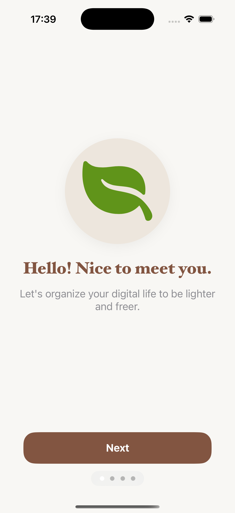
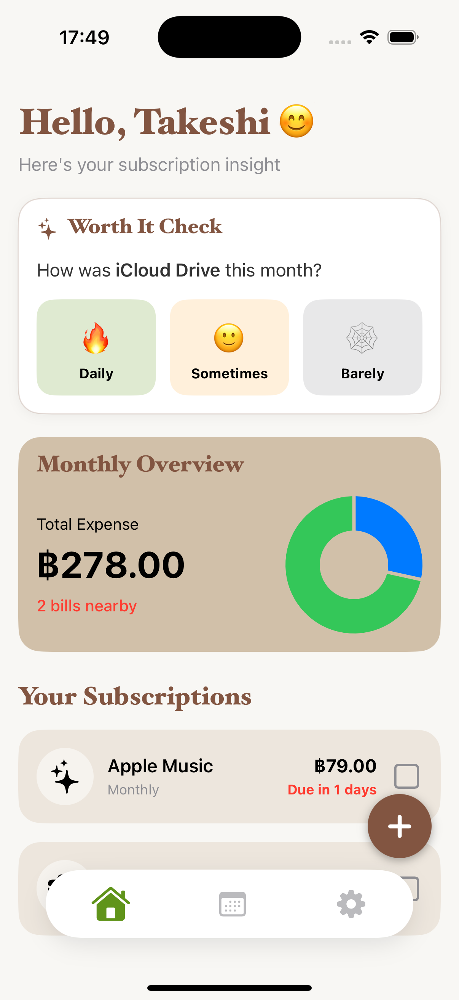
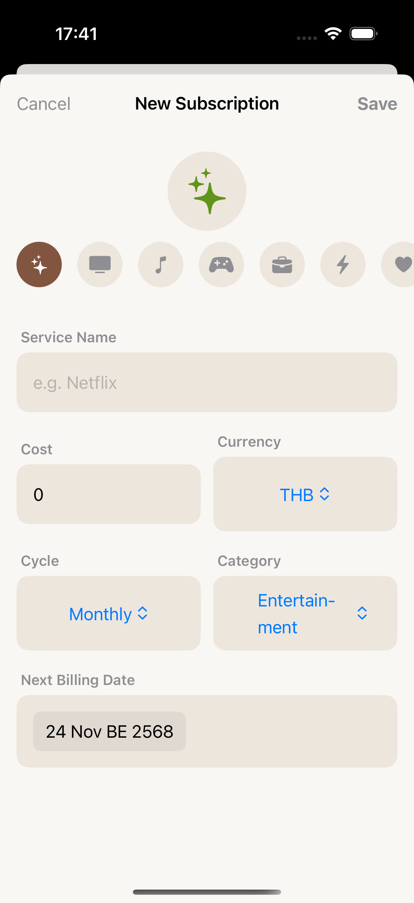
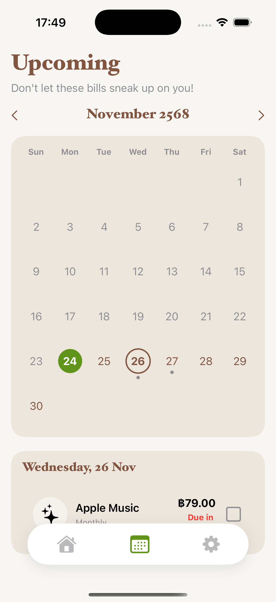

# Mindful Subscribe

**Mindful Subscribe** is an iOS application designed to help you manage subscription services and gain financial awareness.

## About The Project

In today's digital age, subscription models are everywhere—from streaming services to productivity tools. Many users face subscription fatigue, forgetting payment dates, getting charged for unused services, and losing track of their total monthly expenses.

Mindful Subscribe solves these pain points by offering a systematic way to manage subscriptions. It combines bill tracking, advance notifications, and a unique "Worth-it Check" feature to help users decide whether a service is truly worth keeping based on their real usage frequency.

## Key Features

* **Centralized Management:** Store details for all your subscriptions (App Store & Third-party) in one place, categorized for easy access.
* **Smart Reminders:** Get notified before the due date (1 day, 3 days, and 7 days in advance) to avoid unexpected charges, even when the app is closed.
* **Usage Reflection (Worth-it Check):** A feature that prompts you to evaluate the "value" of a service upon payment, helping you decide if you should renew or cancel.
* **Expense Insights:** Visualize your spending with a dashboard showing total monthly/yearly expenses and spending trends .
* **Calendar View:** An "Upcoming" tab displaying a calendar view of your bills to help you plan your finances for the month.

## Screenshots

| Onboarding | Home Dashboard | New Subscription | Upcoming Bills | 
|:---:|:---:|:---:|:---:|
|  |  |  |  |

## Tech Stack

* **Platform:** iOS 
* **Language:** Swift / SwiftUI
* **Course:** CSS361 Mobile Application Development 
